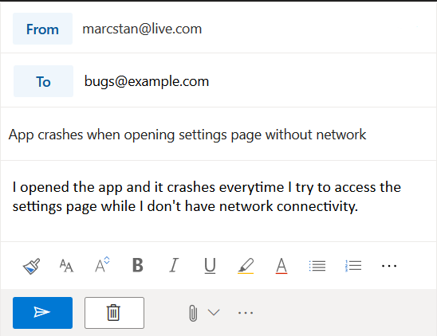
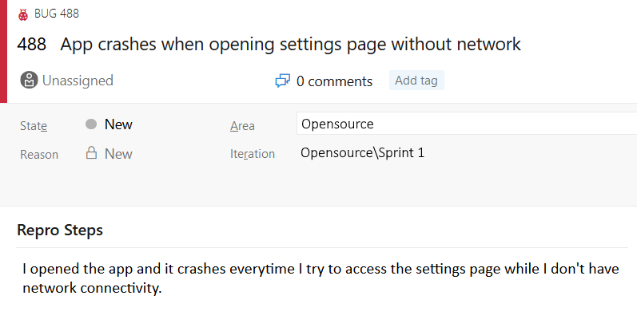

# Email Bugtracker

> Email -> Sendgrid -> Azure function -> Azure DevOps Bug

Write an email:

and have it turn into a bug in Azure DevOps automagically:

# Motivation

This project provides an azure function to convert incoming emails into Azure DevOps bugs.

I wrote this

* because I wanted to use Azure functions
* to reduce complexity (both setting up and running it) compared to mail2bug
* as a learning experience for myself

# Requirements

To use this requires a valid email domain and a sendgrid account (if you don't have one, Azure provides a suitable free tier). Additionally you need an Azure subscription (this solution costs a few cents per month).

## Alternatives

If you are looking for a more feature complete version, look no further than [mail2bug](https://github.com/microsoft/mail2bug). You can even host it on a virtual machine if you have one already.

Alternatively you can also use Flow to achieve a [similar system](https://techcommunity.microsoft.com/t5/PowerApps-Flow/How-to-Manage-VSTS-Bugs-using-Flow-and-SharePoint-Part-1/td-p/89470).

# How it works

This relies on the Sendgrid Webhooks. Specifically the [Inbound Parse](https://sendgrid.com/docs/for-developers/parsing-email/inbound-email/) feature.

`Inbound Parse` will route all mails received at the subdomain through sendgrid and also sends them to the azure function.

Based on the configuration the azure function then ignores or processes the emails and creates bugs in Azure DevOps when necessary.

# How to deploy

See [Setup.md](Setup.md)

# Examples

See [Examples.md](Examples.md)

# Future ideas

* Integration for github/gitlab issues
* Allow different types (feature/workitem) as opposed to only bugs
* Add email attachments to the created workitem (currently they are dropped)
* Allow responding to bugs (create comments in the issue)
    * well known senders would also be allowed to issue commands (#close, #assign, etc.)